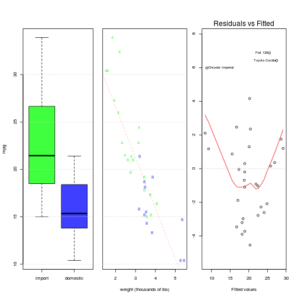
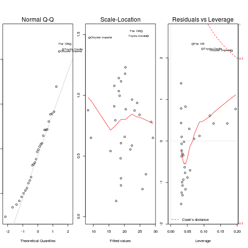

## MPG Calculator
1. When you know approxamatley how much your car weighs in pounds (lbs) ...
2. Want to know a good estimate for MPG? Continue reading for how do use it ..
  

--- .class #id 

## Just Click the link!

https://javastarchild.shinyapps.io/DevelopingDataProductsProject/

--- .class #id 

## Now enter a weight

--- .class #id 

## Press "Compute MPG!" button and see the results!!

* How it works?  
 + R programming tools: http://www.r-project.org/) and 
 + Shiny by RStudio: http://shiny.rstudio.com/tutorial/ and
 + Math stuff: http://www.r-bloggers.com/using-r-for-introductory-statistics-chapter-4/
* See all the code here: https://github.com/javastarchild/DevelopingDataProductsProject
* Note: Pretty graphics on slide #2 based on R code copied from r-bloggers.com link above.
