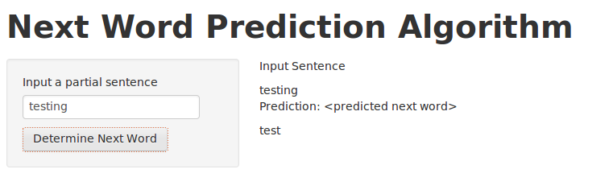

## Introduction
The goal of this application is to create a prediction algorithm for next words in a sentence. This presentation explains how the application and algorithm work. 

--- .class #id 

## Just Click the link!

http://javastarchild.shinyapps.io/NextWordPrediction/

--- .class #id 

## Now enter a sentence

--- .class #id 

## Press "Determine Next Word" button and see the results.

## How it works
A algorithm uses a decsion tree based on NGram frequencies.  These are used to predict the next word.  For example when "Blah bleh" is seen, the highest N frequency 3 Grams with "Blah bleh" as the 1st 2 words will be suggested as the next word.  As another example, when "Blah" is seen, the highest N frequency 2 Grams with "Blah" as the 1st word will be suggested as the next word.
